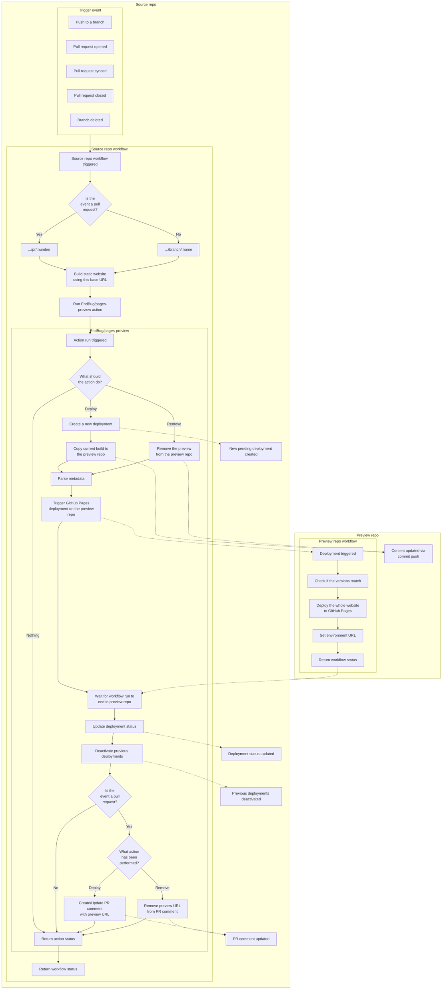

# Action flow diagram

```mermaid
flowchart TD
  subgraph sourceRepo [Source repo]
    subgraph trigger [Trigger event]
      t1[Push to a branch]
      t2[Pull request opened]
      t3[Pull request synced]
      t4[Pull request closed]
      t5[Branch deleted]
    end
    trigger --> s1

    subgraph source [Source repo workflow]
      s1[Source repo workflow triggered] --> s2{Is the\nevent a pull\nrequest?}

      s2 -- Yes --> s3
      s2 -- No --> s4
      
      s3[.../pr/:number] --> s5
      s4[.../branch/:name] --> s5

      s5[Build static website\nusing this base URL] --> s6
      s6[Run EndBug/pages-preview action]

      subgraph action [EndBug/pages-preview]
        a1[Action run triggered] --> 

        a2{What should\nthe action do?}
        a2 -- Deploy --> a30
        a2 -- Remove --> a4
        a2 -- Nothing --> aRet

        a30[Create a new deployment] -->
        a3[Copy current build to\nthe preview repo] --> a5

        a4[Remove the preview\nfrom the preview repo] --> a5

        a5[Parse metadata] -->
        a6[Trigger GitHub Pages\ndeployment on the preview\nrepo] -->
        a7[Wait for workflow run to\nend in preview repo] -->

        a80[Update deployment status] -->
        a81[Deactivate previous deployments] -->

        a8{Is the\nevent a pull\nrequest?}
        a8 -- Yes --> a9
        a8 -- No --> aRet

        a9{What action\nhas been\nperformed?}
        a9 -- Deploy --> a10
        a9 -- Remove --> a11

        a10[Create/Update PR comment\nwith preview URL] --> aRet
        a11[Remove preview URL\nfrom PR comment] --> aRet

        aRet[Return action status]
      end
    
      sRet[Return workflow status]
    end

    PR[PR comment updated]
    D0[New pending deployment created]
    D1[Deployment status updated]
    D2[Previous deployments deactivated]

    s6 --> a1
    aRet --> sRet
    a11 -.-> PR
    a10 -.-> PR
    a30 -.-> D0
    a80 -.-> D1
    a81 -.-> D2
  end

  subgraph previewRepo [Preview repo]
    p0[Content updated via\ncommit push]

    subgraph deploy [Preview repo workflow]
      p2[Deployment triggered] -->
      p3[Check if the versions match] -->
      p4[Deploy the whole website\nto GitHub Pages] -->

      p5[Set environment URL] -->
      pRet[Return workflow status]
    end
  end

  a3 -.-> p0
  a4 -.-> p0
  a6 -.-> p2
  pRet -.-> a7
```
