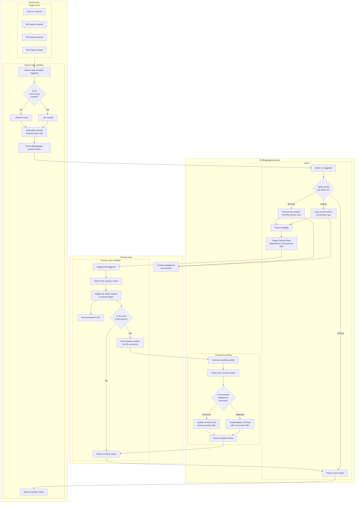

# Action flow diagram

```mermaid

flowchart TD
  subgraph sourceRepo [Source repo]
    subgraph trigger [Trigger event]
      t1[Push to a branch]
      t2[Pull request opened]
      t3[Pull request synced]
      t4[Pull request closed]
    end
    trigger --> s1

    subgraph source [Source repo workflow]
      s1[Source repo workflow triggered] --> s2{Is the\nevent a pull\nrequest?}

      s2 -- Yes --> s3
      s2 -- No --> s4
      
      s3[.../pr/:number] --> s5
      s4[.../branch/:name] --> s5

      s5[Build static website\nusing this base URL] --> s6
      s6[Run EndBug/pages-preview action]
      s7[Return workflow status]
    end
  end
    s6 --> a1

  subgraph thisRepo [EndBug/pages-preview]
    subgraph action [action]
      a1[Action run triggered] --> a2{What should\nthe action do?}
      
      a2 -- Deploy --> a3
      a2 -- Remove --> a4
      a2 -- Nothing --> a7

      a3[Copy current build to\nthe preview repo] --> a5
      a4[Remove the preview\nfrom the preview repo] --> a5

      a5[Parse metadata] --> a6
      a6[Trigger GitHub Pages\ndeployment on the preview\nrepo]

      a7[Return action status]
    end

    subgraph commentWorkflow [Comment workflow]
      c1[Comment workflow called] --> c2
      c2[Check if the versions match] --> c3
      c3{Is the preview\ndeployed or\nremoved?}

      c3 -- Deployed --> c4
      c3 -- Removed --> c5

      c4[Create/update comment\nwith the preview URL] --> c6
      c5[Update comment and\n remove preview URL] --> c6
      c6[Return workflow status]
    end
  end

  a3 --> p0
  a4 --> p0
  a6 --> p2
  a7 --> s7

  subgraph previewRepo [Preview repo]
    p0[Content updated via\ncommit push]

    subgraph deploy [Preview repo workflow]
      p2[Deployment triggered] --> p3
      p3[Check if the versions match] --> p4
      p4[Deploy the whole website\nto GitHub Pages]

      p4 --> p5[Set environment URL]
      p4 --> p6{Is the event\na pull request?}

      p6 -- Yes --> p7[Call reusable workflow\nfor PR comments]
      p6 -- No --> p8[Return workflow status]
    end
  end

  p7 --> c1
  p8 --> a7
  c6 --> p8
```
